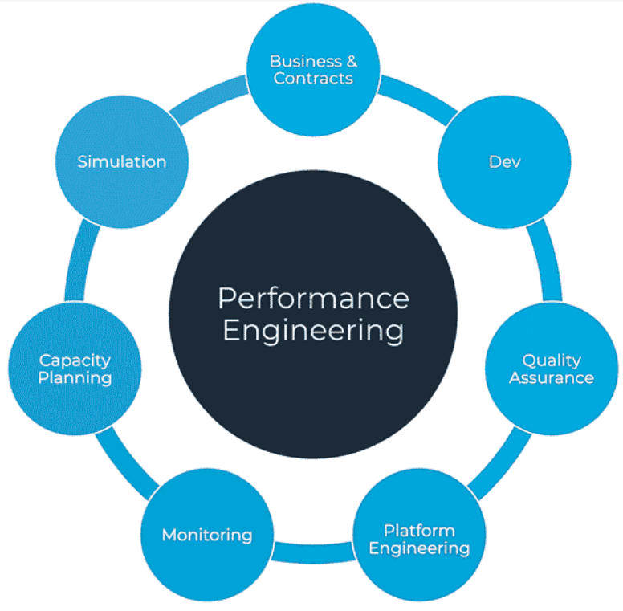

<!-- PROJECT LOGO -->
 

  

  <h3 align="center">Permormance Engineering</h3>

  

    Course Taken at NTNU Trondheim
  

<!-- ABOUT THE PROJECT -->
## About The Project

Course based on simulations and optimizing codelogic.

<!-- GETTING STARTED -->
## Getting Started

Code is purely python. Visualization is done through the terminal with print functions.

### Built With

* Python

<!-- CONTACT -->
## Contact

Skjalg Nysaeter - skjalgn@gmail.com

Project Link: [https://github.com/skjalgn/ProjectSpotify](https://github.com/skjalgn/ProjectSpotify)

(<a href="#readme-top">back to top</a>)

